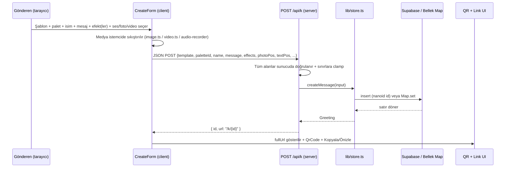
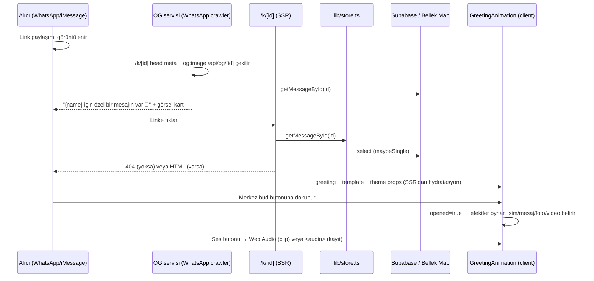
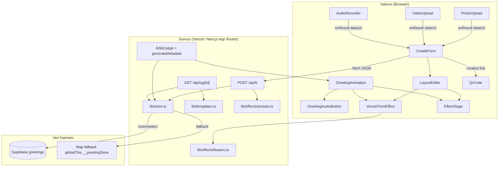
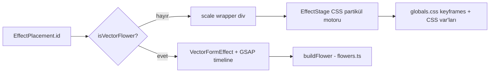

# PROJE ANALİZİ: surprise-bloom (Animasyonlu Tebrik Linki Uygulaması)

> Bu rapor, `surprise-bloom` deposunun kaynak kodları, konfigürasyon dosyaları, veritabanı şeması, dokümantasyonları ve git geçmişi incelenerek hazırlanmıştır. Amaç, projeyi hiç incelememiş bir geliştirici veya yapay zekânın, koda bakmadan mimariyi, veri akışını ve iş mantığını eksiksiz anlayabilmesidir. Tüm tespitler kod tabanından çıkarılmıştır; bu rapor hazırlanırken hiçbir kod değişikliği yapılmamıştır.

---

## 1. Projenin Amacı ve Çözdüğü Problem

**surprise-bloom**, kullanıcıların **kişiselleştirilmiş, animasyonlu tebrik linkleri** oluşturup bu linkleri WhatsApp, SMS, iMessage vb. kanallar üzerinden paylaşmasını sağlayan, tamamen web tabanlı (mobil öncelikli) bir "sürpriz kartı" uygulamasıdır.

**Çözdüğü problemler:**

1. **Geleneksel tebrik kartının dijitalleştirilmesi:** Fiziksel kart, e-posta veya düz metin mesajı yerine; açılınca çiçek açma, konfeti, parçacık patlaması gibi görsel efektler oynayan ve kişiye özel isim/mesaj gösteren sürpriz bir deneyim sunar.
2. **Paylaşım önizlemesi (Open Graph) sorunu:** WhatsApp ve iMessage, paylaşılan bir URL'nin `<head>` meta etiketlerini okuyarak önizleme kartı oluşturur. Her tebrik için **dinamik olarak üretilen** 1200×630'luk bir OG görseli sunulur (`/api/og/[id]`), böylece alıcı linki açmadan önce "X için özel bir mesajın var 💖" kartını görür.
3. **Kısa, temiz link sorunu:** Türkçe karakter ve emoji içeren uzun URL parametreleri yerine, veritabanında tutulan içeriğe işaret eden 6 karakterlik benzersiz ID (`/k/aB3xZ9`) üretilir. Bu hem linki kısa tutar hem de OG önizlemelerinin cache tutarlılığını (her mesaj için benzersiz URL) sağlar.
4. **Sıfır maliyetli sürdürülebilirlik:** Uygulama Vercel (ücretsiz plan) + Supabase (ücretsiz plan) üzerinde barındırılır; ses klipleri **tarayıcıda Web Audio API ile sentezlenir** (harici dosya yok), çiçek efektleri **prosedürel SVG** olarak üretilir (dış varlık yok), fotoğraf/video istemci tarafında sıkıştırılıp base64 data URL olarak saklanır (Supabase Storage gerektirmez). Böylece toplam operasyon maliyeti 0 TL'dir.
5. **iOS ses otomatik oynatma kısıtı:** Safari, kullanıcı etkileşimi olmadan ses çalmayı engeller. Uygulama bu kısıtı "sürpriz modu" ile çözer: alıcı önce kapalı bir tomurcuk/gift butonu görür; dokunduğunda animasyon + metin + ses aynı anda tetiklenir.

---

## 2. Kullanılan Teknolojiler ve Tercih Nedenleri

| Katman | Teknoloji | Sürüm | Neden Tercih Edildiği |
|---|---|---|---|
| Framework | **Next.js (App Router)** | 16.2.12 | Dinamik route (`/k/[id]`), Server Components, serverless API route'ları (`/api/*`), `generateMetadata` + `ImageResponse` ile sunucu tarafı OG görseli; tek repo içinde fullstack. |
| UI Kütüphanesi | **React** | 19.2.4 | Bileşen tabanlı arayüz; Next.js'in temeli. |
| Dil | **TypeScript** | 5.9.3 | `strict` mod; `@/*` path alias ile modüler tip güvenliği. |
| Stil | **Tailwind CSS 4** | 4.3.3 | Utility-first CSS; `@tailwindcss/postcss` ile derlenir; tema/dark mod desteği. |
| Animasyon (ana efekt) | **Prosedürel SVG + GSAP** | GSAP 3.15.0 | Çiçekler deterministik olarak SVG path'e dönüştürülür, GSAP timeline ile `draw` (kalem çizimi) ve `grow-up` (sap büyümesi) reveal animasyonları yapılır. Dosya yükü yok, WebGL gerektirmez. |
| Partikül motoru | **CSS Keyframes + JS (özel motor)** | — | `lib/effects/engine.tsx`; phyllotaxis (altın açı) tabanlı parçacık yerleşimi, CSS değişkenleriyle (`--ang`, `--dist`, `--spin`) animasyonlar. Harici kütüphane yok. |
| Veritabanı | **Supabase (PostgreSQL)** | @supabase/supabase-js 2.111.0 | Ücretsiz katman; SQL Editor ile tek script'te şema kurulumu; RLS politikaları; anon anahtarla doğrudan insert/select. |
| Kısa ID | **nanoid** | 6.0.0 | `customAlphabet` ile 6 karakter, tekrarı düşük alfabe. |
| QR kod | **qr-code-styling** | 1.9.2 | Temaya uygun renk, merkezde emoji ikonu, PNG indirme; tamamen istemci tarafı. |
| Hosting | **Vercel** | — | Next.js ile doğrudan uyumlu; sunucusuz fonksiyon gövde limiti (~4.5MB) video boyut sınırını belirler. |
| Font | **next/font (Geist)** + sistem font yığınları | — | `layout.tsx` Geist'i yükler; metin stilleri `lib/fonts.ts` ile **sistem fontları** kullanır (ağ gerektirmez). |
| 3D (kullanılmıyor) | three, @react-three/fiber, drei, postprocessing | 0.185.1 / 9.7.0 / 10.7.7 / 3.0.4 | Depoda mevcut ama hiçbir sayfaya bağlı değil (bkz. §11 "Atıl kod"). |

**Not:** `detectPerformance` tabanlı WebGL/FPS fallback mekanizması (`lib/performance.ts`, `hooks/use-fps-monitor.ts`, `components/rose-scene.tsx`, `components/three-scene.tsx`, `components/scene-error-boundary.tsx`, `lib/rose.ts`) tasarlanmış ve yazılmış ancak mevcut mimaride **hiçbir yerde import edilmemektedir**. Grep doğrulamasıyla bu dosyaların app bileşenlerinden referans alınmadığı tespit edilmiştir; efekt sistemi tamamen SVG/CSS tabanlıdır.

---

## 3. Klasör Yapısının Ayrıntılı Açıklaması

```
surprise-bloom/
├── app/                              # Next.js App Router kök dizini
│   ├── layout.tsx                    # Kök layout: Geist fontları, metadataBase, html/body
│   ├── page.tsx                      # Ana sayfa (/) → CreateForm bileşeni
│   ├── globals.css                   # Tailwind import + tüm efekt keyframe'leri
│   ├── favicon.ico                   # Site favicon'u
│   ├── api/
│   │   ├── k/route.ts                # POST /api/k → tebrik oluşturma (validasyon + persist)
│   │   └── og/[id]/route.tsx         # GET /api/og/[id] → 1200×630 dinamik OG görseli
│   ├── k/[id]/
│   │   ├── page.tsx                  # GET /k/[id] → tebrik sayfası (SSR) + generateMetadata
│   │   └── not-found.tsx             # Geçersiz/silinmiş ID için 404 ekranı
│   └── preview/page.tsx              # Geliştirme aracı: eski vs yeni efekt karşılaştırması
├── components/                       # Client bileşenler
│   ├── create-form.tsx               # Link oluşturma formu (tüm seçenekleri toplar)
│   ├── layout-editor.tsx             # Sürükle-bırak konum / boyut / hız editörü + önizleme
│   ├── greeting-animation.tsx        # Alıcının gördüğü tebrik sahnesi
│   ├── greeting-audio.tsx            # Ses çalma/durdurma butonu (alıcı tarafı)
│   ├── audio-recorder.tsx            # MediaRecorder ile ≤10sn ses kaydı
│   ├── photo-upload.tsx              # Fotoğraf seçme + sıkıştırma
│   ├── video-upload.tsx              # Video seçme/kaydetme + doğrulama
│   ├── qr-code.tsx                   # Temaya uyumlu QR üretimi + PNG indirme
│   ├── vector-form-effect.tsx        # SVG çiçek animasyon bileşeni (GSAP)
│   ├── rose-scene.tsx                # (ATIL) 3D gül parçacık sahnesi — import edilmiyor
│   ├── three-scene.tsx               # (ATIL) 3D çiçek + düşen yapraklar — import edilmiyor
│   └── scene-error-boundary.tsx      # (ATIL) WebGL hata sınırı — import edilmiyor
├── hooks/
│   └── use-fps-monitor.ts            # (ATIL) FPS ölçüm hook'u — import edilmiyor
├── lib/                              # Domain mantığı ve yardımcı modüller
│   ├── types.ts                      # Tüm domain tipleri (Greeting, Template, Theme, ...)
│   ├── templates.ts                  # 4 şablon × 3 palet; getTemplate/getPalette
│   ├── store.ts                      # Veri katmanı (Supabase veya bellek fallback)
│   ├── supabase.ts                   # Supabase client kurulumu + isSupabaseConfigured
│   ├── clips.ts                      # Web Audio ile sentezlenen 4 hazır müzik klibi
│   ├── fonts.ts                      # 4 yazı stili (sistem font yığınları)
│   ├── image.ts                      # İstemci tarafı görsel sıkıştırma (WebP/JPEG)
│   ├── video.ts                      # Video tür/boyut/süre doğrulama + data URL
│   ├── performance.ts                # (ATIL) WebGL/FPS algılama
│   ├── rose.ts                       # (ATIL) 3D gül nokta geometrisi
│   └── effects/
│       ├── types.ts                  # EffectConfig, ParticleShape, MotionPattern tipleri
│       ├── presets.ts                # 30 efekt tanımı + EFFECT_CATEGORIES + default eşleşmesi
│       ├── engine.tsx                # CSS partikül motoru (EffectStage)
│       └── flowers.ts                # Prosedürel SVG çiçek üreteci (10 çiçek)
├── supabase/
│   └── schema.sql                    # greetings tablosu + RLS + index (idempotent)
├── public/                           # create-next-app varsayılan SVG'leri (kullanılmıyor)
├── .env.example                      # Ortam değişkeni şablonu (Supabase + site URL)
├── .env.local                        # Yerel: Vercel OIDC token (gitignore'da)
├── .env.supabase                     # Vercel CLI env snapshot (Supabase anahtarları içerir)
├── .gitignore                        # node_modules, .env*, .next, tsbuildinfo vb.
├── next.config.ts                    # Boş Next.js konfigürasyonu
├── eslint.config.mjs                 # Flat config: core-web-vitals + typescript
├── postcss.config.mjs                # Tailwind PostCSS plugin
├── tsconfig.json                     # strict TS + @/* alias + next plugin
├── package.json                      # Bağımlılıklar ve script'ler
├── package-lock.json                 # Kilitli bağımlılık ağacı
├── next-env.d.ts                     # Next tip referansları (otomatik)
├── tsconfig.tsbuildinfo              # TS incremental build önbelleği (gitignore'da)
├── README.md                         # create-next-app varsayılanı (özel içerik yok)
├── YAYIN.md                          # Vercel + Supabase yayın rehberi
└── tebrik-link-projesi-raporu.md     # Tasarım/planlama raporu (faz takibi)
```

---

## 4. Her Önemli Dosyanın Görevi ve Diğer Dosyalarla İlişkisi

### 4.1 `lib/types.ts` — Domain Model (Sistemin kalbi)
Tüm alan nesnelerini tanımlar:
- `TemplateId`: `"valentine" | "birthday" | "newyear" | "special"`.
- `Theme`: `id, label, background, ogBackground, accent, centerColor, textColor, petalColors[]`. `background` bir **CSS gradient string**'idir; `ogBackground` OG görseli için lineer gradienttir.
- `Template`: `id, label, emoji, messages[], palettes: Theme[]`.
- `Position`: `{ x, y, scale?, fontSize? }` — ekran yüzdesi koordinat; fotoğraf ölçeği ve yazı boyutu çarpanları.
- `EffectRepeat`: `"once" | "loop" | "every"`.
- `EffectPlacement`: `{ id, x?, y?, scale?, speed?, repeat?, repeatEvery? }` — bir efektin sahneye yerleşimi.
- `Greeting`: Kalıcı kayıt tipi; `effect` alanı **legacy** (ilk efektin id'si), `effects` çoklu yerleşim; `photoPos/textPos` konumlar; `animationSpeed` genel hız çarpanı; `textFont` yazı stili id'si.
- `CreateGreetingInput`: `Greeting`'in yazılabilir karşılığı (id/createdAt yok).
- `GreetingAudio`: `{ type: "clip", value }` (hazır klip id) veya `{ type: "recording", value }` (base64 data URL).

### 4.2 `lib/templates.ts` — Şablon ve Palet Kaynağı
4 şablon, her biri 3 renk paleti + 3 varsayılan Türkçe mesaj + emoji içerir. `FALLBACK_PALETTE` (pastel pembe) geçersiz durumlarda kullanılır. `getTemplate(id)` → şablon; `isTemplateId(value)` → type guard; `getPalette(template, paletteId)` → palet veya ilk palet veya fallback.

### 4.3 `lib/supabase.ts` — Client Kurulumu
`NEXT_PUBLIC_SUPABASE_URL` + `NEXT_PUBLIC_SUPABASE_ANON_KEY` ikisi de varsa `createClient(...)` döner ve `isSupabaseConfigured = true`; yoksa `supabase = null`. Bu bayrak `store.ts`'te veri katmanı seçimini belirler.

### 4.4 `lib/store.ts` — Veri Katmanı (Kritik Dosya)
- `customAlphabet(ALPHABET, 6)` ile ID üretimi; alfabe karıştırılabilir karakterler (0/O/1/I/l) barındırmaz.
- Bellek fallback için `globalThis.__greetingStore` (Map) — Next.js route'ları ayrı bundle derlendiği için global paylaşım yapılır.
- `createMessage(input)`:
  1. Şablon doğrulaması (`getTemplate`).
  2. Palet çözümü (`getPalette`).
  3. Satır oluşturma: `name.slice(0,80)`, `message.slice(0,2000)`, `photo.slice(0,1_000_000)`, `video.slice(0,4_000_000)`; `audio/effects/photo_pos/text_pos` JSON.stringify ile text/jsonb kolonlara.
  4. `animation_speed` ve `text_font` **yalnızca değer varsa** eklenir (şema güncellenmemiş eski ortamlarda insert'i bozmamak için — koşullu spread).
  5. Supabase varsa `.insert(row).select().single()`; hata → `"Mesaj veritabanına kaydedilemedi."`; yoksa Map'e yazar.
- `getMessageById(id)`: Supabase `.eq("id").maybeSingle()` veya Map get.
- `rowToGreeting`: DB satırını `Greeting`'e çevirirken savunmacı `parsePosition/parseEffects/parseAudio` ile **sınır değer clamp'leri** uygular (x/y 5–95, scale 0.4–3, fontSize 0.5–2, speed 0.4–3, repeatEvery 3–120). JSON string veya nesne olabilecek kolonları güvenle ayrıştırır.

### 4.5 `app/api/k/route.ts` — Tebrik Oluşturma Endpoint'i
`POST /api/k`. Tamamı sunucu tarafında doğrulama yapar (bkz. §9.1). Başarıda `{ id, url: "/k/{id}" }` döner. `parsePos`, `parseEffects`, `parseAudio` yardımcıları route içinde de kopyalanmıştır (store.ts ile aynı mantık — DRY ihlali, bkz. §14).

### 4.6 `app/k/[id]/page.tsx` — Alıcı Sayfası (SSR)
`force-dynamic`; `getMessageById` → yoksa `notFound()`. Şablon/palet çözülür, `GreetingAnimation` (client) render edilir. `generateMetadata` OG başlık/özellik üretir: `"{name} için özel bir mesajın var {emoji}"` + `og:image: /api/og/{id}` (mutlak URL'ler `metadataBase` üzerinden çözülür).

### 4.7 `app/api/og/[id]/route.tsx` — Dinamik OG Görseli
`next/og` `ImageResponse` ile 1200×630 PNG üretir. Veri `getMessageById`'den; emoji şablondan; renkler palet `ogBackground/textColor/petalColors`'dan; isim/mesaj fallbackleri vardır.

### 4.8 `components/create-form.tsx` — Oluşturucu Arayüzü
Tek büyük form. State: `templateId, paletteId, name, message, layout (LayoutState), audio, photo, video, creating, error, created`. `handleSubmit` → `fetch("/api/k")` → başarıda `fullUrl = origin + url`; QR + kopyala/önizle butonları. `LayoutState` içinde `effects: EffectPlacement[]`, `photo/text Pos`, `videoScale`, `animationSpeed`, `textFont` tek kaynak olarak tutulur. `DEFAULT_LAYOUT.effects` şablon 0'ın (valentine → `heartburst`) varsayılan efektiyle başlar.

### 4.9 `components/layout-editor.tsx` — WYSIWYG Düzen Editörü
Form içinde canlı önizleme kutusu (telefon/web oranı). Pointer Events tabanlı sürükleme: fotoğraf, yazı, her efektin emoji marker'ı; köşe tutamaçlarıyla orantılı resize (foto) ve yatay font-size (yazı). `ScaleSlider` bileşeniyle boyut/hız sliders; `TEXT_FONTS` butonları; her efekt için `repeat` select + `repeatEvery` input; "Konum ve boyutları sıfırla". Tüm değişiklikler `onChange(photoPos, textPos, videoScale, effects)` geri çağrısıyla `CreateForm`'a akar.

### 4.10 `components/greeting-animation.tsx` — Alıcı Deneyimi
`opened` state'i ile "sürpriz modu" kontrolü. `reducedMotion` için `matchMedia("(prefers-reduced-motion: reduce)")`. Render mantığı:
- Her `EffectPlacement` için: `getEffect(id)` → eğer `isVectorFlower(id)` ise `VectorFormEffect` (scale/position/speed/repeat props), değilse `EffectStage` (scale'li wrapper + origin).
- Kapalıyken merkezde bud butonu (`theme.centerColor`, emoji pulse).
- Açılınca fotoğraf (``, data URL), isim+müsaede metni, varsa `<video>` gösterilir; hepsi `photoPos/textPos` yüzde konumlarında, `theme.accent` glow ile.
- Sağ alt köşede `GreetingAudioButton`.

### 4.11 `components/vector-form-effect.tsx` — SVG Çiçek Animasyonu
`buildFlower(config.id, config.colorPalette)` ile çiçek yapısını memoize eder. `useLayoutEffect` içinde GSAP timeline kurar:
- **draw** stilleri: petal path'lerine `strokeDasharray/offset` + `strokeDashoffset→0` (kalem çizimi), sonra `fillOpacity 1` (boyama), merkez `back.out` pop, kök scale settle.
- **grow-up** stilleri: `clipPath` rect alttan açılır, kök `y:60→0` + salınım, petaller fade+scale.
- `reducedMotion` → tüm elemanlar final duruma set edilir.
- `speed` → `tl.timeScale(speed)`; `repeat:"loop"` → `tl.repeat(-1)`; `repeat:"every"` → interval ile `tl.restart(true)`.
- `position` verilirse 0×0 wrapper + `translate(-50%,-50%)` ile ekran yüzdesi koordinatta; `mixBlendMode: screen`.
- Hook'ların tümü `if (!active) return null` öncesinde çağrılır (hooks kuralı korunur).

### 4.12 `lib/effects/flowers.ts` — Prosedürel SVG Çiçek Üreteci
10 çiçek (rose, peony, daisy, tulip, orchid, sunflower, lily, magnolia, daffodil, cherryblossom). Ortak yerleşim yardımcıları: `placePetalLayer` (katmanlı petaller + iç kıvrım çizgileri), `placeCenter`, `placeStem` (sap + 2 yaprak), `placeStamens`. Deterministik asimetri `jitFor(seed,k)` (sin-hash). Renk yardımcıları `hexToRgb/rgbToHex/shade`. Gradient defs: petal (koyu→açık), center (radial), highlight (beyaz radial), stem/leaf (yeşil). `isVectorFlower(id)` ve `buildFlower(id, palette)` dışa aktarır.

### 4.13 `lib/effects/engine.tsx` — Partikül Motoru (EffectStage)
CSS keyframe tabanlı. `generate(config)`:
- **phyllotaxis** (bloom-spiral): `ang = i * 137.508` (altın açı), `dist = Math.sqrt(i) * spread * 0.25`, boyut merkezde büyük dışta küçük.
- radial (burst/swirl): eşit açı bölümleri + katman ofseti.
- Viewport'a göre parçacık sayısı kısılır (<480px → ≤150, <768px → ≤200).
- Şekil stilleri: `petal` radial-gradient ile, `heart/star/spark/confetti/circle` inline SVG data-URI (`svgUri`) ile gradient + highlight; `aurora` blur circle; diğerleri emoji.
- CSS değişkenleri `--ang/--dist/--spin/--drift/--op/--s` keyframe'leri parametrize eder; hız çarpanı `inv = 1/speed` ile `animationDuration/Delay`'e uygulanır; `repeat:"every"` container `key` remount ile yeniden oynatılır.

### 4.14 `lib/effects/presets.ts` — Efekt Kataloğu
`EFFECTS: Record<string, EffectConfig>` — 30 efekt, 3 kategoride (bloom ×10, burst ×10, ambient ×10). Her biri `category, particleShape, particleCount, colorPalette, motionPattern, layerCount, timing {duration, stagger, ease, loop?}, spread?, sway?, size?`. `getEffect` (bilinmeyen → rose), `hasEffect` (id doğrulaması), `EFFECT_CATEGORIES`, `DEFAULT_EFFECT_BY_TEMPLATE` (valentine→heartburst, birthday→confetti, newyear→fireworks, special→rose).

### 4.15 Medya yardımcıları
- `lib/image.ts`: `fileToDataUrl` — max 900px'e küçültür, canvas ile WebP (desteklenmiyorsa JPEG), kalite 0.82. **Büyük dosya sunucuya gitmez.**
- `lib/video.ts`: `videoFileToDataUrl` — `video/*` tür kontrolü, `MAX_VIDEO_BYTES ≈ 2.8MB`, `MAX_VIDEO_SECONDS = 15` (metadata ile süre okuma); FileReader ile base64.
- `lib/clips.ts`: Web Audio API ile 4 klip sentezi (`tone`, `padTone`, `master` yardımcıları; NINNI/KONFETI/KAR_CANI frekans dizileri). Harici dosya yok, offline çalışır.
- `lib/fonts.ts`: `TEXT_FONTS` — system/zarif/el-yazısı/daktilo; `getTextFont(id)`.

### 4.16 `supabase/schema.sql`
Idempotent şema: `create table if not exists`, `add column if not exists`, RLS enable + `drop policy if exists` + anon insert/select politikaları, `created_at desc` index.

### 4.17 Dokümantasyon
- `tebrik-link-projesi-raporu.md`: Konsept raporu; mimari kararlar, faz planı (1–11), maliyet, riskler. **Geliştirme sürecini anlamak için kritik.**
- `YAYIN.md`: Vercel + Supabase kurulum/deploy rehberi; env değişkenleri, doğrulama adımları, ücretsiz katman sınırları.
- `README.md`: create-next-app varsayılanı; özel içerik yok.

---

## 5. Uygulamanın Başlangıçtan Son Kullanıcıya Çalışma Akışı

### 5.1 Oluşturucu Akışı (Gönderen)



### 5.2 Alıcı Akışı (Linki Açan)



### 5.3 Zamanlama Özeti
1. **Öncesi:** Gönderen formu doldurur → medya istemcide sıkıştırılır → POST.
2. **Oluşturma:** Sunucu doğrular, ID üretir, kalıcılaştırır, `{id,url}` döner.
3. **Paylaşım:** `fullUrl` kopyalanır; WhatsApp önizleme kartı OG endpoint'ten beslenir.
4. **Açılış:** SSR sayfa veriyi çeker, `GreetingAnimation` hydrat olur.
5. **Sürpriz:** Kullanıcı dokunuşu → efekt + metin + (isteğe bağlı) ses.

---

## 6. Veri Akışı ve Bileşenlerin İletişimi

**İletişim yüzeyleri:**
1. **Client → Server:** Yalnızca `POST /api/k` (JSON). `create-form.tsx:68` `fetch("/api/k")`.
2. **Server → DB:** Supabase REST (insert/select) veya in-memory Map.
3. **Server → Client (SSR):** `GreetingAnimation` props'ları (`greeting`, `template`, `theme`).
4. **Server → Crawler:** `generateMetadata` (k/[id]/page.tsx) + `/api/og/[id]` `ImageResponse`.
5. **Bileşenler arası (client):** `CreateForm` → `LayoutEditor` (props + callback `onChange`), `PhotoUpload/VideoUpload/AudioRecorder` (callback `onResult`), `GreetingAudioButton` (props `audio`), `QrCode` (props `value/theme/emoji`).

**Tek yönlü veri akışı:** Form state'i `CreateForm`'da tek kaynaktır; `LayoutEditor` tüm düzen değişikliklerini yukarı bildirir (lifted state). Efektler `effects: EffectPlacement[]` ile `greeting-animation`'da her biri bağımsız pozisyon/ölçek/hız/tekrar ile render edilir.

**Medya verisi:** Fotoğraf/video/ses kaydı **istemci tarafında base64 data URL'ine dönüştürülür** ve JSON içinde `POST /api/k`'ya gider; sunucu `photo ≤ 1M karakter`, `video ≤ 4M karakter` doğrulaması yapar; satırda `text`/`jsonb` kolonlarında saklanır; alıcı sayfası bu data URL'leri doğrudan `src` olarak kullanır.

**Ölçek/hız parametrizasyonu:** `EffectPlacement.scale/speed/repeat/repeatEvery`, global `animationSpeed` ve `effectScale` (legacy) ile hiyerarşik birleşir: `scale = placement.scale ?? effectScale ?? 1`, `speed = placement.speed ?? animationSpeed ?? 1` (greeting-animation.tsx:60,70).

---

## 7. Mimari Yapı

### 7.1 Katmanlı Mimari



### 7.2 Efekt Yönlendirme Mantığı (greeting-animation.tsx)



---

## 8. Veritabanı Yapısı ve İlişkiler

Tek tablo: `public.greetings` (supabase/schema.sql).

| Kolon | Tip | Açıklama |
|---|---|---|
| `id` | `text PK` | nanoid 6 karakter (kısa link ID'si) |
| `template` | `text NOT NULL` | Şablon id (`valentine`/`birthday`/`newyear`/`special`) |
| `palette` | `text NULL` | Palet id (önceki sürümlerde `paletteId` olarak da geçer) |
| `name` | `text NULL` | Alıcı adı (80 karaktere kısıtlanır; `drop not null` ile opsiyonel) |
| `message` | `text NULL` | Kişisel mesaj (2000 karakter) |
| `audio` | `jsonb NULL` | `{type:"clip",value}` veya `{type:"recording",value:base64}` |
| `photo` | `text NULL` | Base64 data URL (≤1M karakter) |
| `video` | `text NULL` | Base64 data URL (≤4M karakter ≈3MB) |
| `position` | `text NULL` | Metin konumu: `top`/`center`/`bottom` (legacy) |
| `effect` | `text NULL` | Legacy: ilk efekt id'si |
| `effects` | `jsonb NULL` | `EffectPlacement[]` (çoklu efekt + konum + ölçek + hız + tekrar) |
| `photo_pos` | `jsonb NULL` | `{x,y,scale}` |
| `text_pos` | `jsonb NULL` | `{x,y,fontSize}` |
| `effect_scale` | `real NULL` | Legacy global efekt ölçeği |
| `video_scale` | `real NULL` | Video ölçeği |
| `animation_speed` | `real NULL` | Genel animasyon hız çarpanı (0.4–3) |
| `text_font` | `text NULL` | Yazı stili id |
| `created_at` | `timestamptz DEFAULT now()` | Oluşturma zamanı; `created_at desc` index'li |

**İlişkiler:** Tablo yalıtılmıştır; FK yok. İlişkiler yalnızca uygulama katmanında: `template` → `templates.ts`, `palette` → palet listesi, `effect/effects[].id` → `EFFECTS`/`BUILDERS`, `audio.clip` → `clips.ts`, `text_font` → `TEXT_FONTS`.

**RLS politikaları:**
- `anon_greetings_insert`: `with check (true)` — herkes (anon) insert edebilir.
- `anon_greetings_select`: `using (true)` — herkes okuyabilir.
- Güncelleme/silme politikası **kasıtlı olarak yoktur** → kalıcı, silinemez kayıtlar.
- `drop policy if exists` sayesinde script tekrar çalıştırılabilir.

---

## 9. API'ler, Servisler ve İş Mantığı

### 9.1 `POST /api/k` — Validasyon Zinciri (route.ts)
1. JSON parse hatası → 400 "Geçersiz istek."
2. `template` zorunlu, string olmalı.
3. `paletteId` verildiyse ilgili şablona ait olmalı (`t.palettes.some`).
4. `textFont` verildiyse `TEXT_FONTS` içinde olmalı.
5. `audio`: `parseAudio` — clip tipi için `getClip(value)` doğrulaması; recording için `data:audio` prefix.
6. `position` ∈ {top, center, bottom}.
7. `effect` verildiyse `hasEffect`.
8. `effects`: dizi olmalı; her öğe `id` + `hasEffect`; x/y/scale/speed/repeat/repeatEvery clamp (5–95 / 0.4–3 / 0.4–3 / 3–120).
9. `photoPos/textPos`: `parsePos` (sayısal x/y + clamp).
10. `effectScale/videoScale/animationSpeed`: finite sayı (sonra 0.4–3 clamp).
11. `photo`: `data:image` prefix + `length ≤ 1_000_000`.
12. `video`: regex `^data:video/(webm|mp4|ogg);(?:[a-z0-9_.=,-]+;)*base64,` + `length ≤ 4_000_000` (Vercel gövde limiti).
13. `createMessage` hata fırlatırsa → 400 `err.message`.

**Cevap:** `{ id, url: "/k/{id}" }` (200).

### 9.2 `GET /api/og/[id]`
`force-dynamic`; `ImageResponse` 1200×630. Veri yoksa fallback değerlerle (emoji `💌`, name `Sevgili`, message ilk şablon mesajı) yine görsel üretir. Palet `ogBackground`'u arka plan, `petalColors` renkli noktalar.

### 9.3 `GET /k/[id]` (page + metadata)
Server component; `force-dynamic`; veri yoksa `notFound()`. `generateMetadata` OpenGraph meta üretir.

### 9.4 `lib/store.ts` servis fonksiyonları
- `createMessage(input): Promise<Greeting>`
- `getMessageById(id): Promise<Greeting | undefined>`

### 9.5 İş Mantığı Özetleri
- **Hız çarpanı:** `EffectStage`'te `inv = 1/speed`; `VectorFormEffect`'te `tl.timeScale(speed)`.
- **Tekrar:** "loop" → CSS `infinite` / GSAP `repeat(-1)`; "every" → interval tabanlı remount/restart; "once" → varsayılan.
- **Phyllotaxis:** `ang = i*137.508`, `dist = sqrt(i)*spread*0.25` — merkez yoğun, dışa açılan yaprak sarmalı.
- **QR renk kontrastı:** `relativeLuminance` (WCAG) ile palet içinden en koyu renk nokta rengi; `accent` köşe noktası; merkezde emoji (canvas → PNG data URL).

---

## 10. Önemli Sınıflar, Fonksiyonlar ve Algoritmalar

### 10.1 ID üretimi — `store.ts:18-19`
```ts
const ALPHABET = "ABCDEFGHJKLMNPQRSTUVWXYZabcdefghijkmnopqrstuvwxyz23456789";
const nanoid = customAlphabet(ALPHABET, 6);
```
~56^6 ≈ 3.1×10¹⁰ kombinasyon; karıştırılabilir karakterler çıkarılmış.

### 10.2 Phyllotaxis partikül yerleşimi — `engine.tsx:130-146`
Altın açı (137.508°) + karekök mesafe. Eşit dağılımlı "çiçek açma" deseni üretir.

### 10.3 SVG data-URI şekil üretimi — `engine.tsx:37-73`
`svgUri(kind, base, light, dark)` — lineer gradient + radial highlight içeren inline SVG'i `encodeURIComponent` ile CSS background-image data URL'e çevirir. Heart/star/spark/confetti/circle.

### 10.4 Deterministik sahte-rastgele — `flowers.ts:89-92`
```ts
function jitFor(seed: number, k: number): number {
  const x = Math.sin(seed * 12.9898 + k * 78.233) * 43758.5453;
  return x - Math.floor(x);
}
```
Aynı seed + indeks → aynı değer (organik görünüm, tekrar üretilebilir).

### 10.5 Petal path üretimi — `flowers.ts:97-124`
Bézier eğrileriyle kapalı petal (`M 0 0 C ... Z`), opsiyonel çentik (cherryblossom) ve jitter asimetrisi.

### 10.6 GSAP draw/grow-up timeline'ları — `vector-form-effect.tsx:78-210`
`draw`: strokeDasharray/offset animasyonu + fillOpacity; `grow-up`: clipPath açılma + kök y-kayması + salınım. `tl.timeScale(speed)`, `tl.repeat(-1)`, `tl.restart(true)` ile hız/tekrar.

### 10.7 Radyal gradient QR kontrastı — `qr-code.tsx:7-28`
`relativeLuminance(hex)` WCAG formülü (0.2126R+0.7152G+0.0722B, linearize); `darkest(colors)` paletin en koyusunu seçer → tarama güvenliği.

### 10.8 `useFpsMonitor` (ATIL) — `hooks/use-fps-monitor.ts`
rAF ile 500ms'lik pencere FPS ölçümü; artık kullanılmıyor.

### 10.9 `buildRosePoints` (ATIL) — `lib/rose.ts`
Altın açı + `sqrt` + scallop/kıvrım terimleriyle 3D gül nokta bulutu; `components/rose-scene.tsx` ile kullanılırdı.

---

## 11. Bağımlılıkların Görevleri

### Çalışma zamanı (`dependencies`)
| Paket | Görev |
|---|---|
| `next` 16.2.12 | App Router, SSR, API route'ları, `ImageResponse`, `next/font` |
| `react` / `react-dom` 19.2.4 | UI; server/client component hidrasyonu |
| `@supabase/supabase-js` 2.111.0 | Supabase REST (PostgREST) client; insert/select |
| `nanoid` 6.0.0 | Kısa ID üretimi |
| `qr-code-styling` 1.9.2 | Canvas tabanlı markalı QR üretimi + PNG indirme |
| `gsap` 3.15.0 | Vektör çiçek timeline animasyonları |
| `three` 0.185.1 | (ATIL) 3D sahne |
| `@react-three/fiber` 9.7.0 | (ATIL) React–Three köprüsü |
| `@react-three/drei` 10.7.7 | (ATIL) OrbitControls vb. |
| `@react-three/postprocessing` 3.0.4 | (ATIL) Bloom efekt kompozitörü |
| `@types/three` 0.185.3 | (ATIL) three tip tanımları |

### Geliştirme (`devDependencies`)
| Paket | Görev |
|---|---|
| `tailwindcss` 4 + `@tailwindcss/postcss` | Utility CSS; PostCSS plugin ile derleme |
| `typescript` 5.9.3 | Tip kontrolü / derleme |
| `eslint` 9 + `eslint-config-next` 16.2.12 | Flat-config lint (core-web-vitals + TS) |
| `@types/node`, `@types/react`, `@types/react-dom` | Ortam tipleri |

---

## 12. Konfigürasyon Dosyalarının Açıklaması

| Dosya | İçerik / Önemli Noktalar |
|---|---|
| `package.json` | Script'ler: `dev`, `build`, `start`, `lint` (`eslint`). `@/*` alias TS tarafında. |
| `tsconfig.json` | `strict`, `target ES2017`, `moduleResolution: bundler`, `jsx: react-jsx`, `paths: {"@/*":["./*"]}`, Next plugin. |
| `next.config.ts` | Boş (`NextConfig`). Güvenlik başlıkları, image config yok. |
| `eslint.config.mjs` | Flat config: `eslint-config-next/core-web-vitals` + `/typescript`; ignore: `.next`, `out`, `build`, `next-env.d.ts`. |
| `postcss.config.mjs` | `@tailwindcss/postcss` plugin. |
| `.gitignore` | `node_modules`, `.env*` (`.env.example` hariç), `.next`, `.vercel`, `*.tsbuildinfo`, `next-env.d.ts`. |
| `.env.example` | `NEXT_PUBLIC_SUPABASE_URL`, `NEXT_PUBLIC_SUPABASE_ANON_KEY`, `NEXT_PUBLIC_SITE_URL`; boşsa bellekte fallback. |
| `.env.local` | Yalnızca `VERCEL_OIDC_TOKEN` içerir (Vercel CLI üretimi; **sırdır**, gitignore'da). Supabase anahtarı yok → yerel geliştirme bellek fallback ile çalışır. |
| `.env.supabase` | Vercel CLI env snapshot; `NEXT_PUBLIC_SUPABASE_*` + site URL + Vercel sistem değişkenleri içerir (**sırlar içerir**; `layout.tsx` metadataBase ve `supabase.ts` bunları kullanabilir ama Next varsayılan olarak bu dosyayı yüklemez). |
| `.vercel/project.json` | `projectName: tebrik-mesaj`; Vercel CLI bağlantısı. |

**Ortam değişkeni kullanım noktaları:**
- `NEXT_PUBLIC_SITE_URL` → `app/layout.tsx:17` (`metadataBase`).
- `NEXT_PUBLIC_SUPABASE_URL` + `NEXT_PUBLIC_SUPABASE_ANON_KEY` → `lib/supabase.ts`.

---

## 13. Güvenlik, Performans ve Kod Kalitesi Değerlendirmesi

### 13.1 Güvenlik
**Güçlü:**
- Sunucu tarafı kapsamlı giriş doğrulaması (`/api/k`); tip ve sınır kontrolleri (uzunluk, prefix, regex, clamp).
- RLS: yalnızca anon insert/select; update/delete kapalı.
- Medya data URL'leri `data:image`/`data:video`/`data:audio` prefix'iyle sınırlı; React text node render'ı ile XSS riski düşük (HTML enjeksiyon yok).
- Fotoğraf, canvas ile **yeniden çizilerek** WebP'e dönüştürülür — ham SVG/güvensiz içerik geçmez.
- Gizli değerler (`VERCEL_OIDC_TOKEN`, Supabase anahtarları) gitignore'lanmış env dosyalarında; repoya commit edilmez.
- Şablon/palet/efekt/font id'leri **beyaz liste** doğrulamasından geçer (bilinmeyen değer reddedilir).

**Zayıf:**
- **Kimlik doğrulama / rate limiting yok:** Anonim herkes sınırsız insert yapabilir (DB şişme / spam riski). `POST /api/k`'da origin/CSRF kontrolü yok (endpoint public olduğu için düşük risk).
- **Okuma erişimi açık:** `select` politikası tüm tebrikleri anonim okumaya açar; ID tahmini zor olsa da (56⁶) gizlilik açısından not edilmeli.
- Medya boyutu DB'de `text` olarak tutulur; kötüye kullanım DB limitlerini (500MB free) hızla doldurabilir.
- Güvenlik başlıkları (CSP, HSTS vb.) `next.config.ts`'te tanımlı değil.

### 13.2 Performans
**Güçlü:**
- Medya istemcide sıkıştırılır (900px WebP; video ≤15sn/~3MB) → düşük yükleme maliyeti.
- Video boyutu Vercel sunucusuz gövde limitine göre ayarlanmış (~4.5MB).
- Partikül sayısı viewport'a göre kısılır (≤150/200/300).
- `prefers-reduced-motion` desteği; efektler yalnızca `active` iken render edilir (açılmadan DOM'a yüklenmez).
- CSS animasyonları GPU hızlandırmalı; `will-change: transform, opacity`.
- `force-dynamic` SSR: her istekte güncel veri (cache sorunu yok).
- Base64 medyanın `getMessageById` ile her açılışta tek istekle gelmesi (ek storage isteği yok).

**Zayıf:**
- Loop efektler (ambient kategorisi) sürekli animasyon → mobilde pil/GPU tüketimi.
- Tüm medya tek satırda base64 → her görüntüleme tüm satırı indirir (foto+video+açık), büyük tebriklerde ilk boya yavaşlar.
- `photo` için React `` kullanımı (Next Image optimizasyonu yok); `no-img-element` eslint disable ile geçilmiş.
- 3D kütüphaneler (three/fiber/drei) pakette bağımlılık olarak kalsa da **import edilmediği için bundle'a girmez**; yine de install boyutunu artırır.
- ID → veri okuma PK index'li, ancak herhangi bir GET cache (ISR/CDN) yok; yüksek trafikte her istek DB'ye gider.

### 13.3 Kod Kalitesi
**Güçlü:**
- TypeScript strict; domain tipleri merkezileşmiş (`lib/types.ts`).
- Savunmacı ayrıştırma (DB'den gelen veri doğrulanıp clamp'leniyor).
- `nanoid` custom alfabe; global store paylaşımı bundle'lar arası tutarlılık sağlıyor.
- Yorumlar Türkçe, amaç açıklayıcı; repo içi bellek (`.opencode/memory.md`) karar geçmişini tutuyor.
- ESLint flat config temiz; belirli React hooks kuralları için gerekçeli `eslint-disable`.

**Zayıf:**
- **Validasyon kodu kopyalanmış:** `parsePos/parseEffects/parseAudio` hem `route.ts` hem `store.ts`'te ayrı ayrı mevcut (DRY ihlali; güncellemede iki yer).
- **globals.css'te kopya bloklar:** `.petal/.bloom/.flower-center/.pop/.bud/.particle/.greeting-text` anahtarları **iki kez** yazılı (satır 30–140 ve 141–252) — ölü kod.
- **Test yok:** test framework'ü veya test dosyası yok; doğrulama manuel/puppeteer (raporlarda bahsediliyor, repoda script yok).
- **Ölü kod:** 3D bileşenler, `use-fps-monitor`, `lib/performance.ts`, `lib/rose.ts` kullanılmıyor.
- `public/` içindeki SVG'ler create-next-app varsayılanları (kullanılmıyor).
- `README.md` şablon olarak kalmış (özel dokümantasyon `YAYIN.md` ve `tebrik-link-projesi-raporu.md`'de).
- `next.config.ts` boş; image optimizasyonu, güvenlik başlıkları, hata yönetimi yapılandırması yok.
- Şema gelişimi `schema.sql`'e el ile `alter` eklemeyle; gerçek migration sistemi yok (Supabase CLI migration kullanılmıyor).

---

## 14. Projenin Güçlü ve Zayıf Yönleri

### Güçlü
1. **Sıfır maliyet mimarisi:** Vercel + Supabase free; ses sentezi ve prosedürel SVG ile dış varlık yok.
2. **Etkileyici efekt çeşitliliği:** 30 efekt (10 vektör çiçek + 20 partikül/ambient), palet/tema sistemi.
3. **Kullanıcı kontrolü:** Sürükle-bırak konumlandırma, ölçek/hız/tekrar kontrolü, yazı stili, çoklu efekt seçimi — "kart tasarımı" deneyimi.
4. **Paylaşım önizleme döngüsü:** Dinamik OG görseli, QR, kısa link birleşik.
5. **Sağlam sunucu doğrulaması ve savunmacı ayrıştırma** (veri her katmanda doğrulanıyor).
6. **Graceful degradation:** Supabase yokken bellek fallback; `prefers-reduced-motion` desteği.
7. **iOS ses kısıtı çözümü** sürpriz-modu dokunuşuyla.

### Zayıf
1. **Ölçeklenebilirlik:** Medyanın base64 olarak satırda tutulması DB boyutunu ve istek boyutunu şişirir.
2. **Güvenlik açıkları:** Rate limiting/abuse koruması yok; anonim okuma açık.
3. **Kod tekrarı ve ölü kod:** Kopya validasyon, kopya CSS, kullanılmayan 3D katman.
4. **Test eksikliği:** Regresyon riski yüksek.
5. **Kalıcılık/tutarlılık:** Migration sistemi yok; `animation_speed/text_font` kolonları schema'ya eklenmiş ama önceki kayıtlar için `alter` bağımlılığı var (store koşullu insert ile korunuyor).
6. **SEO/erişilebilirlik sınırlı:** `alt`/`aria` mevcut ama OG ve meta minimal; `role="button"` öğelerde klavye sıralaması tartışmalı.

---

## 15. Geliştirilmeye Açık Noktalar

1. **Supabase Storage entegrasyonu:** fotoğraf/video/ses'i bucket'a yükleyip satırda yalnızca URL tutmak (DB boyutu + istek boyutu düşer).
2. **Rate limiting / abuse koruması:** IP tabanlı sınır, insert öncesi CAPTCHA veya oturum token'ı.
3. **Merkezileştirilmiş validasyon:** `parsePos/parseEffects/parseAudio`'yu tek `lib/validation.ts`'e taşımak (DRY).
4. **CSS temizliği:** globals.css'teki kopya blokları silmek.
5. **Ölü kod temizliği:** three/fiber/drei/postprocessing ve ilgili bileşenleri kaldırmak (bundle boyutu).
6. **Otomatik testler:** en azından API validasyonu ve store parse mantığı için Vitest + Supabase mock.
7. **Migration aracı:** Supabase CLI migrations veya `schema.sql` sürümleme.
8. **Önbellekleme stratejisi:** OG görseli için süreli cache; yüksek trafikte CDN/ISR değerlendirmesi.
9. **Analitik / görüntülenme sayacı:** `view_count` veya ayrı tablo (gizlilik değerlendirmesiyle).
10. **Tema sisteminin geliştirilmesi:** daha fazla şablon/palet; kullanıcı tarafından özel renk seçimi.
11. **3D yeniden etkinleştirme:** istersen `detectPerformance` tabanlı pro-efekt olarak üst uç cihazlara sunulabilir (hook'lar hazır).
12. **Test / dökümantasyon:** README'nin gerçek proje dokümantasyonuyla değiştirilmesi.

---

## 16. Yeni Geliştiricinin İnceleme Sırası

1. `tebrik-link-projesi-raporu.md` → proje fikri, faz planı, kararlar.
2. `YAYIN.md` → deploy mimarisi (Vercel + Supabase), env değişkenleri.
3. `package.json` + `tsconfig.json` + `eslint.config.mjs` → araç zinciri.
4. `lib/types.ts` → **tüm domain modeli** (Greeting, Template, Theme, EffectPlacement...).
5. `lib/templates.ts` → şablon/palet verisi.
6. `lib/effects/types.ts` + `lib/effects/presets.ts` → efekt kataloğu ve tipleri.
7. `lib/supabase.ts` + `lib/store.ts` → **veri katmanı** (fallback ve Supabase iki kollu).
8. `app/api/k/route.ts` → **validasyon + oluşturma endpoint'i**.
9. `app/k/[id]/page.tsx` + `app/api/og/[id]/route.tsx` → alıcı + OG sunumu.
10. `components/create-form.tsx` → oluşturucu akışı ve state yönetimi.
11. `components/layout-editor.tsx` → düzen editörü (en karmaşık UI).
12. `components/greeting-animation.tsx` → efekt yönlendirme ve sahne.
13. `lib/effects/flowers.ts` + `components/vector-form-effect.tsx` → vektör çiçek motoru.
14. `lib/effects/engine.tsx` → CSS partikül motoru.
15. `app/globals.css` → keyframe sözlüğü.
16. `supabase/schema.sql` → veritabanı şeması.
17. `.env.example` + `.vercel/project.json` → ortam bağlantıları.

---

## 17. Projeyi Sıfırdan Geliştirmek İsteyen Biri İçin Çalışma Mantığı

**Temel fikir:** "İçerik üret → kısa ID'ye bağla → ID'yi link olarak paylaş → link açılınca sürpriz sahne oynat."

**Katmanlı uygulama adımları:**

1. **Veri modeli:** `Greeting` = ID + şablon + palet + isim/mesaj + opsiyonel medya (base64) + efekt yerleşimleri + hız/yazı ayarları. Bunu `lib/types.ts`'te merkezileştir; şablonları `lib/templates.ts`'te veri olarak tut (4 şablon × 3 palet).

2. **Kalıcılık soyutlaması:** `lib/store.ts`'te `supabase ? insert/select : Map fallback` ikili yapısı. ID'yi `nanoid` ile üret. Tüm okuma/yazma bu modülden geçsin.

3. **Sunucu doğrulama + oluşturma:** `POST /api/k`; her alanı beyaz liste + sınır + clamp ile doğrula; başarıda `{id, url}` dön.

4. **Alıcı sayfası:** `/k/[id]` SSR: `getMessageById` → `notFound` veya `GreetingAnimation`. `generateMetadata` ile OG meta; `metadataBase` üzerinden mutlak URL.

5. **OG görseli:** `/api/og/[id]` → `ImageResponse` ile şablona göre 1200×630 üret. (WhatsApp önizleme cache'i nedeniyle her mesaj benzersiz URL olmalı.)

6. **Efekt sistemi (iki kol):**
   - **Vektör çiçekler:** `flowers.ts` (prosedürel SVG + jitter + gradient defs) → `vector-form-effect.tsx` (GSAP draw/grow-up).
   - **Partikül/ambient:** `engine.tsx` (CSS keyframe + CSS değişkenleri + phyllotaxis).
   - Yönlendirme: `isVectorFlower(id)` → iki bileşenden birine. Konum/ölçek/hız/tekrar `EffectPlacement` ile parametrize.

7. **Medya istemci tarafı:** Görseli canvas'la sıkıştır (WebP ≤900px), videoyu süre/boyut sınırla (≤15sn/~3MB), sesi MediaRecorder ile kaydet → hepsi base64 data URL → POST gövdesinde.

8. **UI:** `CreateForm` (tüm seçenekler) + `LayoutEditor` (canlı WYSIWYG önizleme, drag/resize, sliders) + `GreetingAnimation` (alıcı sahnesi) + `GreetingAudioButton` (iOS gesture uyumlu ses) + `QrCode` (temaya uyumlu, PNG).

9. **Deploy:** Vercel (uygulama) + Supabase (DB, `schema.sql` RLS ile). Env: `NEXT_PUBLIC_SUPABASE_URL/ANON_KEY`, `NEXT_PUBLIC_SITE_URL`. Supabase yokken bellekte çalışır (geliştirme).

**Kritik başarı noktaları:** (a) tüm kullanıcı girdisi sunucuda doğrulanmalı, (b) medya sunucuya küçük gitsin, (c) OG her link için benzersiz olsun, (d) efektler düşük güçlü cihazlarda da akıcı kalsın (partikül kısma + reduced-motion), (e) ses kullanıcı etkileşimiyle başlasın.

---

## Ek A: Çalışma Zamanındaki Gerçek Bağlam (gözlem)

- Git `main` dalında; son commit `9d5baa9` ("Kaydederken mesaj limitini 2000'e yukselt"). Git geçmişi: initial → temel uygulama → 30 efekt + sürükle-bırak → gül phyllotaxis → palet/font/hız → mesaj limiti.
- `.env.local` yalnızca Vercel OIDC token içerir → yerel çalıştırmada `isSupabaseConfigured` false, **bellek fallback** aktiftir (sunucu yeniden başlayınca kayıtlar sıfırlanır).
- `.env.supabase`'te Supabase anahtarları mevcuttur (Vercel CLI snapshot) ama Next bunu varsayılan olarak yüklemez; üretimde Vercel panelinden env atanır.
- `/preview` sayfası yalnızca geliştirme/karşılaştırma içindir (üretimde de erişilebilir).
- `dynamic = "force-dynamic"` sayesinde OG ve `/k/[id]` her istekte taze veri kullanır (paylaşım sonrası içerik değişmez ama cache hatası olmaz).

---

*Bu rapor, 03.08.2026 tarihinde `surprise-bloom` deposunun tamamı taranarak üretilmiştir. Gizli anahtarlar rapora dahil edilmemiştir.*
